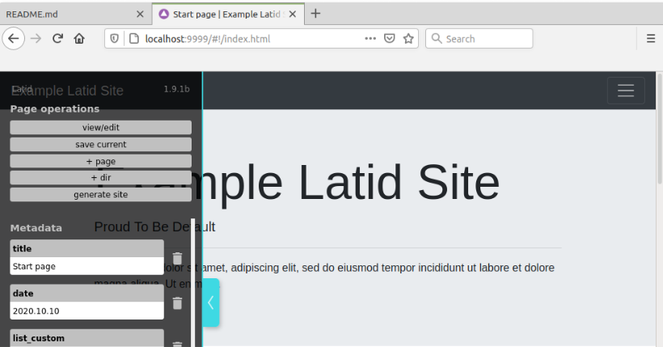

Latid server
============

Reference realization of local server for editing **Latid** sites via browser written in `node.js`. APi is still not stable enough.

 

**[Latid](https://github.com/girobusan/latid)** is a author-centric static site generator, which works as traditional command line
utility and|or with browser based GUI (allowing to use block editor). 
It works best for multipage sites (tested with >2000 pages) with primary static 
(even completely javascript-free) content (blogs, documentation, portfolios). 
For more info see the [ docs ](https://github.com/girobusan/latid/blob/master/docs/index.md).

&#128031;
--------
